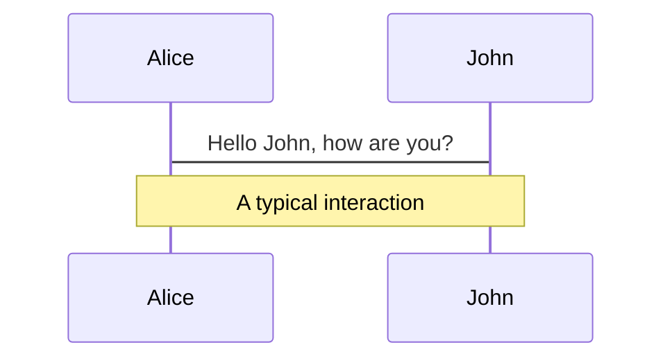
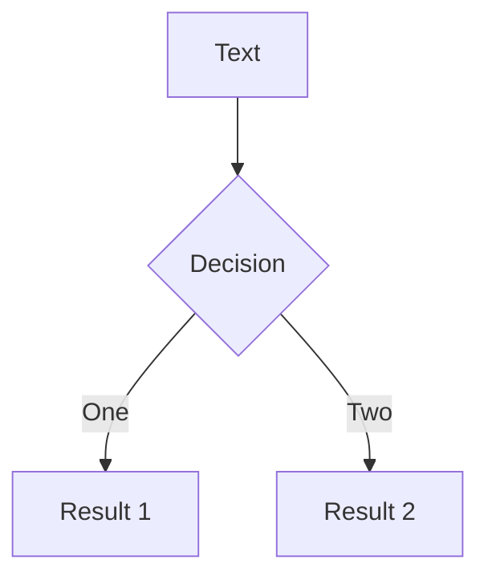

---
# try also 'default' to start simple
theme: seriph
# random image from a curated Unsplash collection by Anthony
# like them? see https://unsplash.com/collections/94734566/slidev
background: https://source.unsplash.com/collection/94734566/1920x1080
# apply any windi css classes to the current slide
class: 'text-center'
# https://sli.dev/custom/highlighters.html
highlighter: shiki
# show line numbers in code blocks
lineNumbers: false
# some information about the slides, markdown enabled
info: |
  ## Slidev Starter Template
  Presentation slides for developers.

  Learn more at [Sli.dev](https://sli.dev)
src: ./pages/cover.md
---

---
src: ./pages/database.md
---

---
src: ./pages/database-swebok.md
---

---
src: ./pages/database-types.md
---

---
src: ./pages/mongodb.md
---

---
src: ./pages/mongodb-install.md
---

# Navigation

Hover on the bottom-left corner to see the navigation's controls panel, [learn more](https://sli.dev/guide/navigation.html)

### Keyboard Shortcuts

|     |     |
| --- | --- |
| <kbd>right</kbd> / <kbd>space</kbd>| next animation or slide |
| <kbd>left</kbd>  / <kbd>shift</kbd><kbd>space</kbd> | previous animation or slide |
| <kbd>up</kbd> | previous slide |
| <kbd>down</kbd> | next slide |
```typescript
const a: Function = () => {
  console.log('xd')
}
```

<!-- https://sli.dev/guide/animations.html#click-animations -->

<p v-after class="absolute bottom-23 left-45 opacity-30 transform -rotate-10">Here!</p>

---
layout: section
---

# Importación, exportación y consulta de datos

BSON, JSON, importación y exportación de datos y consultas básicas


---

# JSON

## JSON
JavaScript Object Notation (La notación de objetos JavaScript)

## Formato
- Empiezan y terminan con llaves {}
- Se separa cada  **clave (key)** y **valor (value)** con un **:** 
- Se separa cada par de  **clave (key)** y **valor (value)**  con una **,**
- Las **claves(key)** deben estar entre comillas **" "**

&rarr; En Mongo las **claves (keys)** se llaman **campos (fields)**


Más información de  [JSON and BSON](https://www.mongodb.com/json-and-bson)

<!--
You can have `style` tag in markdown to override the style for the current page.
Learn more: https://sli.dev/guide/syntax#embedded-styles
-->

<style>
h1 {
  background-color: #2B90B6;
  background-image: linear-gradient(45deg, #4EC5D4 10%, #146b8c 20%);
  background-size: 100%;
  -webkit-background-clip: text;
  -moz-background-clip: text;
  -webkit-text-fill-color: transparent; 
  -moz-text-fill-color: transparent;
}
</style>

---

# JSON

Se representaran de manera notablemente simple en texto: 

```json {all|2|1-6|9|all}
{
  "_id": 1,
  "name" : { "first" : "John", "last" : "Backus" },
  "contribs" : [ "Fortran", "ALGOL", "Backus-Naur Form", "FP" ],
  "awards" : [
    {
      "award" : "W.W. McDowell Award",
      "year" : 1967,
      "by" : "IEEE Computer Society"
    }, {
      "award" : "Draper Prize",
      "year" : 1993,
      "by" : "National Academy of Engineering"
    }
  ]
}
```

<arrow v-click="3" x1="400" y1="420" x2="230" y2="330" color="#564" width="3" arrowSize="1" />

[^1]: [Learn More](https://sli.dev/guide/syntax.html#line-highlighting)

<style>
.footnotes-sep {
  @apply mt-20 opacity-10;
}
.footnotes {
  @apply text-sm opacity-75;
}
.footnote-backref {
  display: none;
}
</style>

---
layout: two-cols
---

# VENTAJAS DE JSON

- Amigable

- Leible

- Familiar
 

::right::

# DESVENTAJAS DE JSON

- Consumo de espacio

- Limitado

- Basado en texto


---

# BJSON

## BJSON
Binary JSON


## BENEFICIOS
Cierra la brecha entre la representación binaria y el formato json

Optimizado
- Velocidad
- Espacio
- Flexibilidad

Alta perfomance


<!--
You can have `style` tag in markdown to override the style for the current page.
Learn more: https://sli.dev/guide/syntax#embedded-styles
-->

<style>
h1 {
  background-color: #2B90B6;
  background-image: linear-gradient(45deg, #4EC5D4 10%, #146b8c 20%);
  background-size: 100%;
  -webkit-background-clip: text;
  -moz-background-clip: text;
  -webkit-text-fill-color: transparent; 
  -moz-text-fill-color: transparent;
}
</style>


---

# JSON

Los  siguientes son algunos documentos de ejemplo (en sintaxis de estilo JavaScript / Python) y sus correspondientes representaciones BSON.

```json {all|2|1-6|9|all}
{"hello": "world"} →

\x16\x00\x00\x00           // total document size
\x02                       // 0x02 = type String
hello\x00                  // field name
\x06\x00\x00\x00world\x00  // field value
\x00                       // 0x00 = type EOO ('end of object')
```


```json {all|2|1-6|9|all}
{"BSON": ["awesome", 5.05, 1986]} →

 \x31\x00\x00\x00
 \x04BSON\x00
 \x26\x00\x00\x00
 \x02\x30\x00\x08\x00\x00\x00awesome\x00
 \x01\x31\x00\x33\x33\x33\x33\x33\x33\x14\x40
 \x10\x32\x00\xc2\x07\x00\x00
 \x00
 \x00
```

<arrow v-click="3" x1="400" y1="420" x2="230" y2="330" color="#564" width="3" arrowSize="1" />

[^1]: [Learn More](https://sli.dev/guide/syntax.html#line-highlighting)

<style>
.footnotes-sep {
  @apply mt-20 opacity-10;
}
.footnotes {
  @apply text-sm opacity-75;
}
.footnote-backref {
  display: none;
}
</style>


---
layout: two-cols
---
# JSON

## Códificación:
UTF-8 String

## Datos soportados
String, Boolean, Number, Array

## Lectura
Humano y Máquina
 

::right::

# BJSON
## Códificación:
Binario

## Datos soportados
String, Boolean, Number (Integer, Long, Float, ...), Array, Date, Raw Binary

## Lectura
Solo Máquina


---

# JSON

## Códificación:
UTF-8 String

## Datos soportados
String, Boolean, Number, Array

## Lectura
Humano y Máquina
 

::right::

# BJSON
## Códificación:
Binario

## Datos soportados
String, Boolean, Number (Integer, Long, Float, ...), Array, Date, Raw Binary

## Lectura
Solo Máquina


---

# Resumen

## BJSON

Mongo guarda data en BJSON internamente y sobre la red

## JSON
Puede ser guardado nativamente y lo puede retornar MongoDB

## CARACTERISTICAS ADICIONALES
MongoBD nos provee flexibilidad y velocidad


---
layout: section
---
# Comandos básicos para el shell de Mongo

---

# Manejo de la BD
Ejecute el comando db para ver la base de datos con la que está trabajando actualmente

```shell {all|2|1-6|9|all}
db
```

Ejecute el comando use para cambiar a una base de datos diferente. Si no tiene una base de datos, aprenda a crear una nueva base de datos .

```shell {all|2|1-6|9|all}
use company
```

Utilice el comando show dbs para mostrar todas las bases de datos

```shell {all|2|1-6|9|all}
show dbs
```

Un comando importante le ayudará a trabajar con el shell de Mongo fácilmente: el comando de ayuda. Ejecute el comando de ayuda para obtener una lista de las opciones de ayuda disponibles en el shell de mongo.
```shell {all|2|1-6|9|all}
Help
```


---

# Manejo de los Datos

## Creación
Puede crear colecciones e insertar datos con el siguiente comando:

- db se refiere a la base de datos actual en uso.
- empleado es el nombre de la colección.
- insertOne es el método para insertar un documento en la colección.

```shell {all|2|1-6|9|all}
db.employee.insertOne ({nombre: "marca"}); 
```

## Lectura
Utilice  método de búsqueda para obtener los datos de una colección. El método forEach (printjson) los imprimirá con formato JSON


```shell {all|2|1-6|9|all}
db.employee.find (). forEach (printjson)
```

---

# Manejo de los Datos

## Actualización
El método updateOne () le permite actualizar un solo documento que cumple una condición.

A continuación se muestra la sintaxis del método updateOne ():

```shell {all|2|1-6|9|all}
db.collection.updateOne(filter, update, options)
```


El operador $ set le permite reemplazar el valor de un campo con un valor especificado. El operador $ set tiene la siguiente sintaxis:

```shell {all|2|1-6|9|all}
{ $set: { <field1>: <value1>, <field2>: <value2>, ...}}
```

Puede crear colecciones e insertar datos con el siguiente comando:
```shell {all|2|1-6|9|all}
db.employee.updateOne({_id: 1}, {
    $set: {
        name: 'Pedro
    }
}); 
```


---

## Eliminiación

El método deleteOne () le permite eliminar un solo documento de una colección.

El método deleteOne () tiene la siguiente sintaxis:

```shell {all|2|1-6|9|all}
db.collection.deleteOne(filter, option)
```


Por Ejemplo

```shell {all|2|1-6|9|all}
db.employee.deleteOne({nombre: "marca"}); 
```


---


---

# Code


<arrow v-click="3" x1="400" y1="420" x2="230" y2="330" color="#564" width="3" arrowSize="1" />

[^1]: [Learn More](https://sli.dev/guide/syntax.html#line-highlighting)

<style>
.footnotes-sep {
  @apply mt-20 opacity-10;
}
.footnotes {
  @apply text-sm opacity-75;
}
.footnote-backref {
  display: none;
}
</style>


# Code

Use code snippets and get the highlighting directly![^1]

```ts {all|2|1-6|9|all}
interface User {
  id: number
  firstName: string
  lastName: string
  role: string
}

function updateUser(id: number, update: User) {
  const user = getUser(id)
  const newUser = {...user, ...update}  
  saveUser(id, newUser)
}
```

<arrow v-click="3" x1="400" y1="420" x2="230" y2="330" color="#564" width="3" arrowSize="1" />

[^1]: [Learn More](https://sli.dev/guide/syntax.html#line-highlighting)

<style>
.footnotes-sep {
  @apply mt-20 opacity-10;
}
.footnotes {
  @apply text-sm opacity-75;
}
.footnote-backref {
  display: none;
}
</style>


---

# Components

<div grid="~ cols-2 gap-4">
<div>

You can use Vue components directly inside your slides.

We have provided a few built-in components like `<Tweet/>` and `<Youtube/>` that you can use directly. And adding your custom components is also super easy.

```html
<Counter :count="10" />
```

<!-- ./components/Counter.vue -->
<Counter :count="10" m="t-4" />

Check out [the guides](https://sli.dev/builtin/components.html) for more.

</div>
<div>

```html
<Tweet id="1390115482657726468" />
```

<Tweet id="1390115482657726468" scale="0.75" />

</div>
</div>


---
class: px-20
---

# Themes

Slidev comes with powerful theming support. Themes can provide styles, layouts, components, or even configurations for tools. Switching between themes by just **one edit** in your frontmatter:

<div grid="~ cols-2 gap-2" m="-t-2">

```yaml
---
theme: default
---
```

```yaml
---
theme: seriph
---
```


</div>

Read more about [How to use a theme](https://sli.dev/themes/use.html) and
check out the [Awesome Themes Gallery](https://sli.dev/themes/gallery.html).

---
preload: false
---

# Animations

Animations are powered by [@vueuse/motion](https://motion.vueuse.org/).

```html
<div
  v-motion
  :initial="{ x: -80 }"
  :enter="{ x: 0 }">
  Slidev
</div>
```

<div class="w-60 relative mt-6">
  <div class="relative w-40 h-40">
    
    
    
  </div>

  <div 
    class="text-5xl absolute top-14 left-40 text-[#2B90B6] -z-1"
    v-motion
    :initial="{ x: -80, opacity: 0}"
    :enter="{ x: 0, opacity: 1, transition: { delay: 2000, duration: 1000 } }">
    Slidev
  </div>
</div>

<!-- vue script setup scripts can be directly used in markdown, and will only affects current page -->
<script setup lang="ts">
const final = {
  x: 0,
  y: 0,
  rotate: 0,
  scale: 1,
  transition: {
    type: 'spring',
    damping: 10,
    stiffness: 20,
    mass: 2
  }
}
</script>

<div
  v-motion
  :initial="{ x:35, y: 40, opacity: 0}"
  :enter="{ y: 0, opacity: 1, transition: { delay: 3500 } }">

[Learn More](https://sli.dev/guide/animations.html#motion)

</div>

---

# LaTeX

LaTeX is supported out-of-box powered by [KaTeX](https://katex.org/).

<br>

Inline $\sqrt{3x-1}+(1+x)^2$

Block
$$
\begin{array}{c}

\nabla \times \vec{\mathbf{B}} -\, \frac1c\, \frac{\partial\vec{\mathbf{E}}}{\partial t} &
= \frac{4\pi}{c}\vec{\mathbf{j}}    \nabla \cdot \vec{\mathbf{E}} & = 4 \pi \rho \\

\nabla \times \vec{\mathbf{E}}\, +\, \frac1c\, \frac{\partial\vec{\mathbf{B}}}{\partial t} & = \vec{\mathbf{0}} \\

\nabla \cdot \vec{\mathbf{B}} & = 0

\end{array}
$$

<br>

[Learn more](https://sli.dev/guide/syntax#latex)

---

# Diagrams

You can create diagrams/graphs from textual descriptions, directly in your Markdown.

<div class="grid grid-cols-2 gap-10 pt-4 -mb-6">





</div>

[Learn More](https://sli.dev/guide/syntax.html#diagrams)


---
layout: center
class: text-center
---

# Learn More

[Documentations](https://sli.dev) · [GitHub](https://github.com/slidevjs/slidev) · [Showcases](https://sli.dev/showcases.html)
