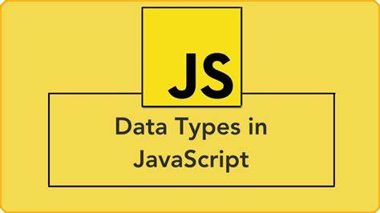
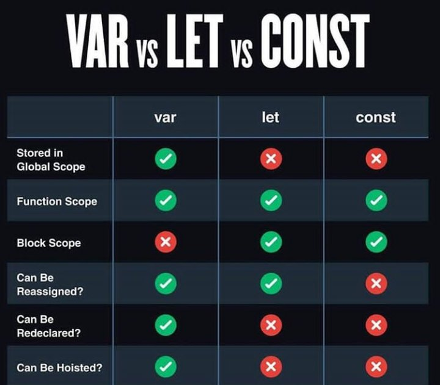
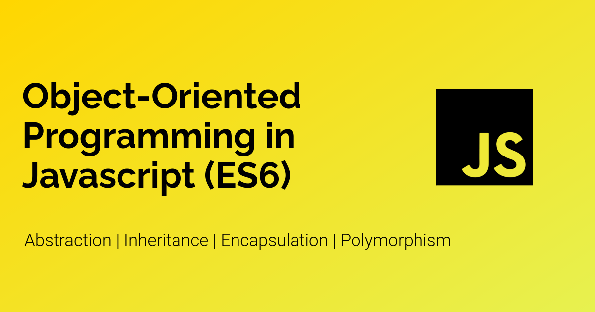

---
# try also 'default' to start simple
theme: seriph
# random image from a curated Unsplash collection by Anthony
# like them? see https://unsplash.com/collections/94734566/slidev
background: https://source.unsplash.com/collection/94734566/1920x1080
# apply any windi css classes to the current slide
class: 'text-center'
# https://sli.dev/custom/highlighters.html
highlighter: shiki
# show line numbers in code blocks
lineNumbers: false
# some information about the slides, markdown enabled
info: |
  ## Slidev Starter Template
  Presentation slides for developers.

  Learn more at [Sli.dev](https://sli.dev)
---

# Taller de Node - Sesión 2
<br>
<br>
<h2>Javascript - ES6 - File System - Read Line</h2>
<br>
<h3>Rony Hancco</h3>
<h3>Giro Pinto</h3>
<style>
  h1{
    font-size: 128px;
  }
  h2{
    color: white;
    font-size: 28px;
  }
  h3{
    color:white;
  }
</style>
<!--
The last comment block of each slide will be treated as slide notes. It will be visible and editable in Presenter Mode along with the slide. [Read more in the docs](https://sli.dev/guide/syntax.html#notes)
-->

---

# Javascript data types

<br>
<br>


```js
let variable  ---> undefined
```

```js
let variable = null ---> null
```

```js
let stringVariable = 'javascript' ---> string
```

```js
let numberVariable = 123 ---> number
```

```js
let booleanVariable = true ---> boolean
```

```js
let objectVariable = {}  ---> object
```

```js
let symVariable = Symbol() ---> symbol
```



<style>
  .image{
    position: absolute;
    top: 10rem;
    right: 5rem;
  } 
</style>

<!--
You can have `style` tag in markdown to override the style for the current page.
Learn more: https://sli.dev/guide/syntax#embedded-styles
-->

---


# Variables

<br>
<br>

```js
var variableName
```
```js
let variableName 
```

```js
const variableName
```



<style>
  .image{
    position: absolute;
    top: 2rem;
    right: 3.5rem;
    width: 550px;
  } 
</style>

---

# Arreglos

<br>

```js

const arr = ['a','b','c']


```
<br>

# Objetos

<br>

```js

const object = {
  prop1: 'hola',
  prop2: 123,
  prop3: [],
  prop4: {},
  ...
}

```
---
layout: center
class: 'text-center'
---

# Operators


<br>


---

# If-Else if -Else 

<br>

```js

if (num > 15) {
  return 'Mayor que 15'
} else if (num < 5) {
  return 'Menor que 5'
} else {
  return 'Entre 5 y 15'
}
```
<br>

# Operador Ternario

<br>

```js
  return a > b ? 'a es el mayor' : 'b es el mayor'
```

---
layout: center
class: 'text-center'
---

# Truthy and Falsy values

<br>


---

# Switch 

```js

switch(num) {
  case value1:
    //...
    break;
  case value2:
    //...
    break;
  case value3:
    //...
    break;
}

```

---

# While

```js

let i = 0

while (i < 10) {
  console.log(i)
  i++
}

```

# Do while

```js

let i = 0

do {
  console.log(i)
  i++
} while (i < 5)

```

---

# For loop

<br>

```js

const arr = ['a', 'b', 'c']

for (let i = 0; i < arr.length; ++i) {
  console.log(arr[i])
}


```
<br>

# For of

<br>

```js

const arr = ['a', 'b', 'c']

for (let v of arr) {
  console.log(v)
}

```
<br>

---

# forEach

<br>

```js

const arr = ['a', 'b', 'c']

arr.forEach((v, i) => console.log(v))


```
<br>

# For in

```js

const object = { a: 1, b: 2, c: 3 }

for (const i in object) {
  console.log(`${i}: ${object[i]}`)
}

```

---

# Functions

<br>

```js

function consoleLogSomething() {
   console.log('Something')
}

const consoleLogSomething = function () {
  console.log('Something')
}

```

<br>

# Arrow functions

<br>

```js

const consoleLogSomething = () => {
  console.log('Something')
}

const returnValue = () => 'value'

```

---

# Import 

<br>

```js
import React ,{ useContext } from 'react'
```

<br>

# Export

<br>

```js
export { myClass, someFunction , ... }
```

---

# Spread Operator

```js

const arr = ['a', 'b', 'c']

let arr2 = [...arr, 'd']

const defaults = {
    author: '',
    title: '',
    year: 2021,
    rating: 5,
}

const book = {
    author: 'Eloquent Javascript',
    title: 'Marijn Haverbeke',
}

const bookWithDefaults = { ...defaults, ...book }

```

---


# Object destructuring

```js

const book = {

    author: 'Eloquent Javascript',
    title: 'Marijn Haverbeke',
    rating: 5
}

const {author as bookAuthor, year='2018'} = book

const {
    author,
    ...additional
} = book

```

---

# Next Steps





<style>
  .img1{
    position: absolute;
    height: 200px;
    left: 150px;
  }
  .img2{
    position: absolute;
    top: 300px;
    left: 250px;
    height: 225px;
  }
  .img3{
    position: absolute;
    top:50px;
    right: 50px;
    height: 250px;
  }
</style>

---

# File System

<br>
<br>
<h2><a href="https://nodejs.dev/learn/reading-files-with-nodejs" target="_blank">ReadFiles</a></h2>
<br>
<br>
<h2><a href="https://nodejs.dev/learn/reading-files-with-nodejs" target="_blank">WriteFiles</a></h2>


<style>
  .img1{
    position: absolute;
    top: 150px;
    height: 300px;
     right: 100px;
  }
</style>

---

# ReadLine

<br>
<br>
<h2><a href="https://nodejs.org/api/readline.html" target="_blank">Read Line doc.</a></h2>
